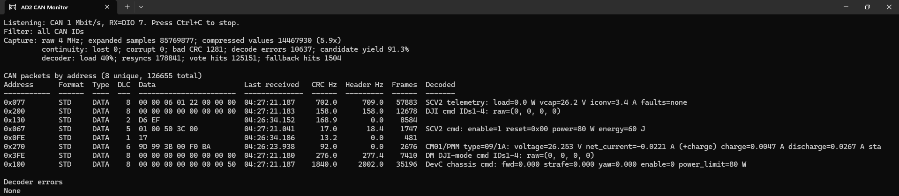

# AD2 CAN Monitor

A passive, high-rate Classic CAN monitor for the Digilent Analog Discovery 2. It batches raw digital samples through the WaveForms SDK, decodes CAN frames locally, groups them by address, measures packet rates, and explains known RoboMaster and supercapacitor messages in real time.

The Windows executable contains Python and all project code. The only runtime prerequisite is Digilent WaveForms, which supplies the device driver and `dwf.dll`.

## Features

- Double-clickable 64-bit Windows console executable
- Passive receive only: no CAN transmission and no acknowledgement generation
- Batched, compressed 4 MHz DigitalIn acquisition instead of one-packet-at-a-time polling
- CRC-15 validation, bit de-stuffing, multi-point sampling and dominant-edge timing resynchronization
- Stable address table with payloads, timestamps, valid-frame rates and header-candidate rates
- Optional post-capture CAN-ID filters
- Decoders for local robot-firmware contracts, SCV2/Faster_Supercap, DJI/DM/LK motors, the 60 V/15 A wattmeter and the reverse-engineered CM01/PMM stream

## How to install

Download `AD2-CAN-Monitor.exe` from the latest GitHub release. It is the complete standalone application; there is no ZIP package and no runtime sidecar files. Digilent WaveForms must also be installed.

### 1. Install WaveForms

Install the 64-bit Windows version of [Digilent WaveForms](https://digilent.com/reference/software/waveforms/waveforms-3/previous-versions). The WaveForms installation includes the SDK library used by this monitor. Digilent also documents the SDK and installation layout in its [WaveForms SDK getting-started guide](https://digilent.com/reference/test-and-measurement/guides/waveforms-sdk-getting-started).

The monitor searches these standard locations:

```text
C:\Program Files\Digilent\WaveForms3\dwf.dll
C:\Program Files\Digilent\WaveFormsSDK\lib\dwf.dll
```

Close the WaveForms application before opening the monitor. Only one application can own an Analog Discovery device at a time.

### 2. Connect the signal

The default input is **DIO 7**.

```text
CAN bus ── CAN transceiver ── RXD logic output ── AD2 DIO 7
                         logic/bus ground ─────── AD2 GND
```

Connect the CAN transceiver VCC pin to AD2 V+ and its ground to AD2 GND. At
startup, the monitor sets V+ to 5.0 V; V- remains disabled. The supplies are
turned off when the monitor exits.

Quick hack: connect the black can wire directly the DIO pin 7, and pray nobody has secretly swapped the pins LOL, make sure its CAN_L if you are paranoid and don't want to fry a neat bit of kit
If the target controller exposes its CAN_RX logic signal, DIO 7 can tap that signal directly. Otherwise, use a CAN transceiver or suitable comparator as a passive receiver.

Note/warning/disclaimer :CAN is differential, while DIO 7 is a single-ended logic input. Direct attachment is electrically and logically unreliable and may exceed the digital input's intended range.

The monitor does not transmit or ACK. It can observe a functioning bus whose real nodes provide acknowledgements. If there is only one transmitter and this passive monitor, the transmitter may continuously retry because nobody asserts the ACK bit.

### 3. Run the program

Double-click `AD2-CAN-Monitor.exe`. With no arguments it uses:

| Setting | Default |
|---|---:|
| Digital input | DIO 7 |
| CAN bitrate | 1,000,000 bit/s |
| Raw sample rate | 4,000,000 sample/s |
| Samples per CAN bit | 4 |
| Display refresh | 24 Hz |
| CAN-ID filter | All addresses |

Press **Ctrl+C** to stop and release the AD2.

The executable is not code-signed. Windows may display a SmartScreen warning for a locally built or newly downloaded copy.

## How to use

Opening it from PowerShell allows options to be supplied:

```powershell
# Default DIO 7, 1 Mbit/s operation
.\AD2-CAN-Monitor.exe

# Display/count only two CAN IDs
.\AD2-CAN-Monitor.exe --filter 0x067 --filter 0x077

# Record for 20 seconds, then stop cleanly
.\AD2-CAN-Monitor.exe --duration 20

# Use DIO 3 on a 500 kbit/s bus; 4 MHz gives 8 samples per bit
.\AD2-CAN-Monitor.exe --dio 3 --bitrate 500000

# Compare against the WaveForms packet-at-a-time CAN decoder
.\AD2-CAN-Monitor.exe --backend decoder

# Disable DWF value/span compression for troubleshooting
.\AD2-CAN-Monitor.exe --uncompressed

# Show every option or the packaged version
.\AD2-CAN-Monitor.exe --help
.\AD2-CAN-Monitor.exe --version
```

The raw backend supports DIO 0 through DIO 7. Its sample rate must resolve to an integer number of at least four samples per CAN bit.

### Reading the dashboard



The live view above shows a sustained busy-bus capture with zero lost or corrupt samples. `CRC Hz` counts fully validated packets, while `Header Hz` helps expose packets rejected later in decoding.

```text
CAN packets by address (6 unique, 78483 total)
Address  Format Type DLC Data                     Last received  CRC Hz Header Hz Frames Decoded
0x077    STD    DATA   8 00 00 06 01 23 00 00 00 02:05:32.778    717.9    ...     24740 SCV2 telemetry...
```

| Display item | Meaning |
|---|---|
| `CRC Hz` | Rate of completely decoded frames whose CAN CRC-15 passed. |
| `Header Hz` | Approximate rate of recognizable ID/DLC headers, including candidates whose later decoding failed. Useful when `CRC Hz` under-reports a busy bus, but it can contain false candidates. |
| `Frames` | Number of CRC-valid frames received since start. |
| `Decoded` | Interpretation selected by standard ID and DLC. Unknown traffic remains visible as raw bytes. |
| `lost` | Raw samples overwritten in the AD2/device-to-host acquisition path. Those samples cannot be recovered. |
| `corrupt` | Samples whose continuity is uncertain according to DWF. |
| `bad CRC` | CAN candidates rejected by the software CRC-15 check. |
| `decode errors` | Candidates rejected for malformed fields, stuffing or trailer structure. |
| `candidate yield` | CRC-valid frames divided by accepted plus rejected candidates. |
| `decoder load` | Fraction of wall time spent expanding samples and decoding CAN. |
| `resyncs` | Bit-timing corrections made on recessive-to-dominant edges—not STM32/CAN retransmissions. |
| `vote hits` / `fallback hits` | Frames recovered by three-point voting or alternate sampling phases. |

The display clips lines to the terminal width so wrapping cannot corrupt subsequent redraws. Maximize the console or use a wide Windows Terminal window to see long decoded descriptions.

Filtering affects the displayed and counted CAN IDs after acquisition. It does not reduce USB traffic or decoder CPU load because the raw samples must still be captured and parsed first.

## Known CAN IDs and meanings

IDs are 11-bit standard Classic CAN unless stated otherwise. The same numeric ID can mean different things on separate physical buses, so interpretations are based on ID, DLC and the contracts available in this workspace.

| CAN ID | DLC | Meaning currently decoded |
|---|---:|---|
| `0x067` | 5 | SCV2 command: enable, reset, power limit in watts and energy target in joules. |
| `0x077` | 8 | SCV2 telemetry: load power, capacitor voltage, converter current and fault flags. |
| `0x077` | 6 | Legacy Faster_Supercap telemetry: chassis power, error and normalized energy. DLC distinguishes it from SCV2. |
| `0x091` | 8 | DM motor MIT-mode feedback at the address used by the searched local robot configurations: state, motor ID, position, velocity, torque and temperatures. |
| `0x100` | 8 | Inter-DevC chassis command: forward, strafe, yaw, enable and power limit. |
| `0x101` | 8 | Inter-DevC status, currently including the supercapacitor charge value. |
| `0x102` | 8 | Inter-DevC four-wheel odometry in RPM. |
| `0x103` | 8 | Inter-DevC attitude vector. |
| `0x104` | 8 | Inter-DevC gyroscope vector. |
| `0x105` | 8 | Inter-DevC acceleration vector. |
| `0x141`–`0x160` | 8 | LK/RMD command or feedback. Known operation bytes include PID, encoder, angle, status, torque, speed and position operations. |
| `0x1FE` | 8 | GM6020 current-mode command for IDs 1–4: signed torque-current demand in amperes (`±16384` = `±3 A`). |
| `0x1FF` | 8 | Shared command: C610/C620 torque current for IDs 5–8, or GM6020 voltage demand for IDs 1–4. The decoder shows every valid interpretation. |
| `0x200` | 8 | C610/C620 torque-current command for IDs 1–4. Because the ID does not identify the controller, both scales are shown: C610 `±10000` = `±10 A`; C620 `±16384` = `±20 A`. |
| `0x201`–`0x204` | 8 | C610/C620 feedback for IDs 1–4: rotor angle in degrees, rotor RPM, estimated torque current and temperature/auxiliary byte. |
| `0x205`–`0x208` | 8 | Shared feedback: C610/C620 IDs 5–8 or GM6020 IDs 1–4. Angle and RPM are exact; controller-specific current interpretations are all shown. |
| `0x209`–`0x20B` | 8 | GM6020 feedback for IDs 5–7: rotor angle, RPM, estimated torque current and temperature. |
| `0x211`, `0x212`, `0x213` | 8 | 60 V/15 A unidirectional wattmeter revisions: voltage and current in hundredths of SI units. The connected unit was observed on `0x213`; its documentation names `0x212` and older `0x211`. |
| `0x270` | variable | Reverse-engineered CM01↔PMM segmented stream. The known measurement message is described below. |
| `0x2FE` | 8 | GM6020 current-mode command for IDs 5–7; bytes 6–7 are reserved. |
| `0x2FF` | 8 | GM6020 voltage-mode command for IDs 5–7. Voltage demand is shown as percent of the documented `±25000` full scale; bytes 6–7 are reserved. |
| `0x301`–`0x308` | 8 | DM motor DJI-mode feedback: angle, RPM (wire value is RPM × 100 in the local firmware), torque/current raw value and temperature. |
| `0x3FE` | 8 | DM DJI-mode torque/current command for IDs 1–4, shown as raw and percent of the local firmware's `±16384` full scale. |
| `0x4FE` | 8 | DM DJI-mode torque/current command for IDs 5–8, shown as raw and percent of the local firmware's `±16384` full scale. |

The DJI group commands are **not target-RPM messages**. The robot firmware closes its own speed or position loop and sends the resulting torque-producing current/voltage demand. Actual rotor RPM comes back in the motor feedback frames. For C610/M2006 and C620/M3508 feedback, the monitor also estimates gearbox-output RPM using the documented `36:1` and `3591:187` ratios. A single-turn rotor angle cannot be converted into an absolute gearbox-output angle without tracking wraparound over time.

Current values marked with `~` use the command full-scale conversion for the feedback field. The manuals identify that field as actual torque current but do not separately state its numeric scale. Shared IDs therefore show all valid controller interpretations instead of silently choosing one. GM6020 voltage-mode commands are shown as percent full scale because the protocol's voltage demand is not a direct measurement in volts.

### CM01/PMM `0x270`

The known measurement is a 30-byte application packet fragmented into four consecutive CAN frames with DLCs `8/8/8/6`. Findings from CRC-valid live captures:

- Header begins `5A 0D 10` followed by a DJI-compatible reflected CRC-8, polynomial representation `0x8C`, seed `0x77`.
- Message type is `09 1A`.
- The final little-endian CRC-16 uses reflected polynomial representation `0x8408` and the empirically recovered seed `0x1862`.
- Three little-endian IEEE-754 floats carry capacitor voltage, discharge-current magnitude and charge-current magnitude.
- Signed net capacitor current is derived as `charge − discharge`, so positive means charging.
- Routes `0x0001` and `0x0080` have been observed carrying duplicate measurements with consecutive sequence numbers.
- The status byte remained `0x00` during the captured drain/charge tests.
- A different `8/8/1` message has been observed but its purpose is still unknown and it is not decoded.

This resembles DJI's protocol family but is not directly compatible with the public `0x55` DUMLv1/S1 framing. Public reverse-engineering references that may help further work include [robomaster_sdk_can](https://github.com/proroklab/robomaster_sdk_can), [robomaster_s1_can_hack](https://github.com/RoboMasterS1Challenge/robomaster_s1_can_hack), [Robomaster-Micropython](https://github.com/JohnieBraaf/Robomaster-Micropython) and the [DJI DUML Wireshark dissector](https://github.com/o-gs/dji-firmware-tools/blob/master/comm_dissector/wireshark/dji-dumlv1-proto.lua).

## Important knowledge for further development

### Capture architecture

`ad2_can_monitor.py` uses WaveForms DigitalIn **record mode**. The AD2 does not send decoded CAN packets in batches. Instead, DWF compresses consecutive equal DIO values into value/span pairs, the host retrieves those records in blocks, and Python expands and decodes them.

The default 4 MHz rate provides four samples per bit at 1 Mbit/s. The decoder:

1. Finds a dominant start edge preceded by enough recessive idle time.
2. Samples each bit using a three-point majority vote.
3. Performs CAN bit de-stuffing.
4. Applies bounded resynchronization on dominant edges.
5. Parses standard data-frame headers and payloads.
6. Validates the CAN CRC-15 and trailer.

The ACK slot is deliberately not required to be dominant. A frame with a valid structure and CRC is counted whether or not another node acknowledged it. Consequently, retransmissions from an unacknowledged transmitter are counted as additional valid frames.

The optional `--backend decoder` mode calls the WaveForms CAN receiver API directly. That API is convenient but returns one packet per call and was observed to miss substantially more traffic on the busy test bus, which is why the raw backend is the default.

### Accuracy and limitations

- The raw decoder currently supports standard, non-RTR Classic CAN data frames. CAN FD, extended identifiers and RTR frames are not decoded by the raw backend.
- Four samples per bit is the minimum supported resolution. Majority voting and edge resynchronization improve phase tolerance, but they cannot reconstruct samples that were never transferred.
- `lost > 0` is a real acquisition discontinuity. The decoder discards its partial frame after any reported loss/corruption rather than joining unrelated sample regions.
- A high `bad CRC` count with zero loss generally means sampling/timing/noise limitations or false start candidates, not USB loss.
- Header rates are diagnostic estimates; only CRC-valid rates and frame counts represent fully validated frames.
- CM01 reassembly abandons a partial message after a missing or unexpected fragment and waits for the next CRC-valid header.
- The monitor is a decoder, not a full electrical CAN interface. Reliable differential reception remains the transceiver/comparator's job.

### Source layout

| File | Responsibility |
|---|---|
| `tools/ad2_can_monitor.py` | DWF acquisition, live dashboard, known-message decoders and the application entry point. |
| `tools/ad2_can_raw_monitor.py` | Incremental raw-sample CAN decoder. Despite the historical name, `RawCanDecoder` is required by the main monitor. The file also retains an older standalone experimental CLI. |
| `tools/test_ad2_can_raw_monitor.py` | Synthetic CAN waveform, timing, CRC, contract and CM01 regression tests. |
| `build.ps1` | Creates an isolated build environment, runs tests and packages the one-file executable. |
| `packaging/version_info.txt` | Windows executable version-resource metadata. |

When adding a decoder, require an exact ID and DLC, document the byte order and scale, and add a regression test using a real or synthetically constructed payload. Avoid assigning meanings from the CAN ID alone when several devices share an address range.

### Building the executable

End users do not need Python. Developers rebuilding the executable need 64-bit Python 3.12 and internet access for the first build:

```powershell
# From the repository root
.\build.ps1

# If Python is not discoverable automatically
.\build.ps1 -Python "C:\full\path\to\python.exe"
```

The script creates `.venv-build`, installs the pinned PyInstaller version, runs the test suite and writes the same standalone file published on GitHub:

```text
dist\AD2-CAN-Monitor.exe
```

To run only the tests:

```powershell
python -m unittest discover -s tools -p "test_*.py" -v
```

## Troubleshooting

| Symptom | What to check |
|---|---|
| `Could not find dwf.dll` | Install 64-bit WaveForms in a standard location. |
| `Devices are busy` | Close WaveForms and any other DWF program, then reconnect/retry. |
| No CAN traffic | Verify bitrate, selected DIO, shared ground, transceiver RXD wiring and that the bus is active. |
| Mostly CRC/decode errors | Confirm the signal is clean logic-level CAN_RX, not CAN_H/CAN_L; verify bitrate and try a higher valid sample rate if host capacity permits. |
| `lost` increases | Keep compression enabled, close heavy applications and avoid unnecessarily high sample rates. Lost samples are unrecoverable. |
| Rates look too low | Compare `CRC Hz` with `Header Hz`. A much higher header rate points to decoder/signal-quality rejection rather than absent traffic. |
| Decoded text is cut off | Widen/maximize the terminal. Lines are intentionally clipped to prevent redraw corruption. |

## Safety and scope

This tool is passive at the protocol level, but probe wiring still affects real hardware. Confirm voltage levels and grounds before connecting the AD2. Do not use the monitor as a replacement for galvanic isolation, a CAN transceiver, or proper bus termination.
